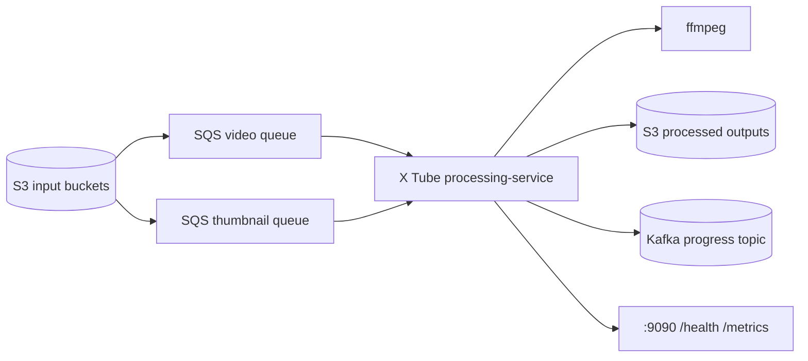

# X Tube Processing Service

The X Tube `processing-service` is the asynchronous media processing service for X Tube. It consumes SQS messages derived from S3 events, downloads uploaded media from S3, processes videos and thumbnails, stores processed outputs back in S3, and publishes Kafka progress events for video chunk uploads.

This documentation covers only the Go service in this repository. It does not document the X Tube frontend, upload API, playback API, auth, catalog, recommendation, or any other service.

## What This Service Does

| Area | Responsibility |
| --- | --- |
| SQS workers | Poll the video and thumbnail queues, renew visibility while work is running, and delete messages only after success. |
| Video processing | Download source videos, transcode with `ffmpeg`, generate segmented MP4 chunks for configured profiles, and upload chunks to S3. |
| Thumbnail processing | Download uploaded thumbnails, preserve the original, generate a resized copy, and write both into a processed layout. |
| Kafka progress | Publish compact video progress events after each successful processed chunk upload. |
| Observability | Expose `/health` and `/metrics` on `:9090`, and emit structured JSON logs. |

## Architecture At A Glance



## Documentation

- [Architecture](docs/architecture.md)
- [Flows](docs/flows.md)
- [Configuration](docs/configuration.md)
- [Operations](docs/operations.md)
- [Portuguese README](README.pt-BR.md)

## Quick Start

From the repository root:

```bash
go test ./...
```

For local execution, provide the service environment variables and run:

```bash
go run ./cmd/processing-service
```

The service exposes:

```bash
curl http://localhost:9090/health
curl http://localhost:9090/metrics
```

## Required Runtime Dependencies

| Dependency | Purpose |
| --- | --- |
| S3-compatible storage | Source media download and processed output upload. |
| SQS-compatible queues | Asynchronous video and thumbnail job delivery. |
| Kafka | Video progress events, unless `KAFKA_ENABLED=false`. |
| `ffmpeg` binary | Video transcoding and segmentation. The Docker image installs it. |

Infrastructure provisioning is outside the scope of this documentation. The service expects the configured buckets, queues, and Kafka topic to exist.

## FFmpeg Runtime Requirement

The Go code invokes `ffmpeg` as an external process.

- When running through the provided Docker image, `ffmpeg` is already installed by the Dockerfile.
- When running directly on a host machine, `ffmpeg` must be available in the host `PATH`.
- If `ffmpeg` is missing, video jobs fail during transcoding.

## Event Contract

Kafka progress events contain only:

```json
{
  "video_id": "video-id",
  "progress_percent": 37
}
```

The event is published only after a processed video chunk is successfully uploaded to S3.

## Not Implemented In This Service

- No public media API.
- No upload orchestration API.
- No playback API.
- No user, auth, catalog, recommendation, or frontend logic.
- No configurable video profile list via environment variables; profiles are currently fixed in code.
- `S3_BUCKET_TEMP` is loaded by configuration but is not used by the current processing flow.
