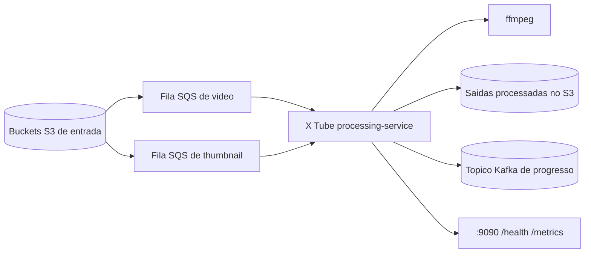

# X Tube Processing Service

O `processing-service` do X Tube e o servico Go de processamento assíncrono de mídia do X Tube. Ele consome mensagens SQS derivadas de eventos S3, baixa mídia enviada para o S3, processa vídeos e thumbnails, grava saídas processadas no S3 e publica eventos Kafka de progresso para uploads de chunks de vídeo.

Esta documentação cobre somente o serviço Go deste repositório. Ela não documenta frontend, upload API, playback API, autenticação, catálogo, recomendação ou qualquer outro serviço do X Tube.

## O Que Este Serviço Faz

| Área | Responsabilidade |
| --- | --- |
| Workers SQS | Faz polling das filas de vídeo e thumbnail, renova visibilidade enquanto processa e deleta mensagens somente após sucesso. |
| Processamento de vídeo | Baixa vídeos originais, transcodifica com `ffmpeg`, gera chunks MP4 segmentados por perfil e faz upload para o S3. |
| Processamento de thumbnail | Baixa thumbnails enviadas, preserva o original, gera cópia redimensionada e grava ambas no layout processado. |
| Progresso Kafka | Publica eventos compactos de progresso depois de cada upload bem-sucedido de chunk processado. |
| Observabilidade | Expõe `/health` e `/metrics` em `:9090` e emite logs JSON estruturados. |

## Arquitetura Em Resumo



## Documentação

- [Arquitetura](docs/architecture.pt-BR.md)
- [Fluxos](docs/flows.pt-BR.md)
- [Configuração](docs/configuration.pt-BR.md)
- [Operações](docs/operations.pt-BR.md)
- [README em inglês](README.md)

## Início Rápido

A partir da raiz do repositório:

```bash
go test ./...
```

Para execução local, forneça as variáveis de ambiente do serviço e execute:

```bash
go run ./cmd/processing-service
```

O serviço expõe:

```bash
curl http://localhost:9090/health
curl http://localhost:9090/metrics
```

## Dependências De Execução

| Dependência | Finalidade |
| --- | --- |
| Storage compatível com S3 | Download da mídia original e upload das saídas processadas. |
| Filas compatíveis com SQS | Entrega assíncrona de jobs de vídeo e thumbnail. |
| Kafka | Eventos de progresso de vídeo, exceto quando `KAFKA_ENABLED=false`. |
| Binário `ffmpeg` | Transcodificação e segmentação de vídeo. A imagem Docker instala o binário. |

Provisionamento de infraestrutura está fora do escopo desta documentação. O serviço espera que os buckets, filas e tópico Kafka configurados já existam.

## Requisito De Runtime Do FFmpeg

O código Go invoca `ffmpeg` como um processo externo.

- Ao rodar pela imagem Docker fornecida, `ffmpeg` já está instalado pelo Dockerfile.
- Ao rodar diretamente em uma máquina host, `ffmpeg` deve estar disponível no `PATH` do host.
- Se `ffmpeg` estiver ausente, jobs de vídeo falham durante a transcodificação.

## Contrato Do Evento

Eventos Kafka de progresso contêm somente:

```json
{
  "video_id": "video-id",
  "progress_percent": 37
}
```

O evento é publicado apenas depois que um chunk de vídeo processado é enviado com sucesso ao S3.

## Não Implementado Neste Serviço

- Nenhuma API pública de mídia.
- Nenhuma API de orquestração de upload.
- Nenhuma API de playback.
- Nenhuma lógica de usuário, autenticação, catálogo, recomendação ou frontend.
- Nenhuma lista de perfis de vídeo configurável por variável de ambiente; os perfis são fixos no código atualmente.
- `S3_BUCKET_TEMP` é carregado pela configuração, mas não é usado pelo fluxo atual de processamento.
