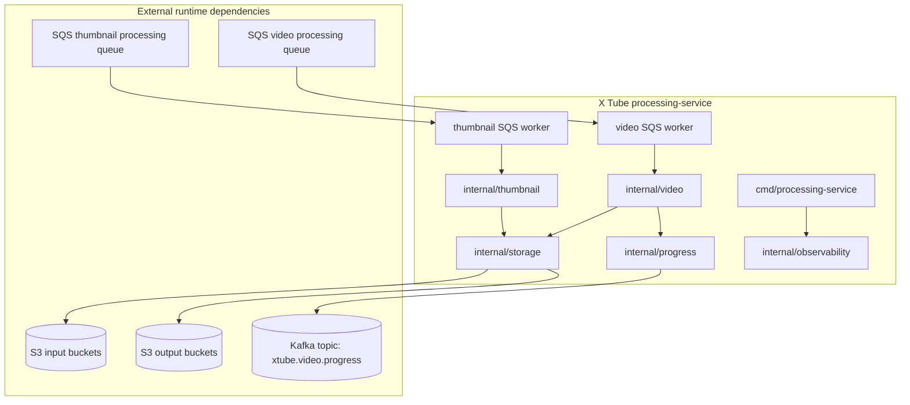
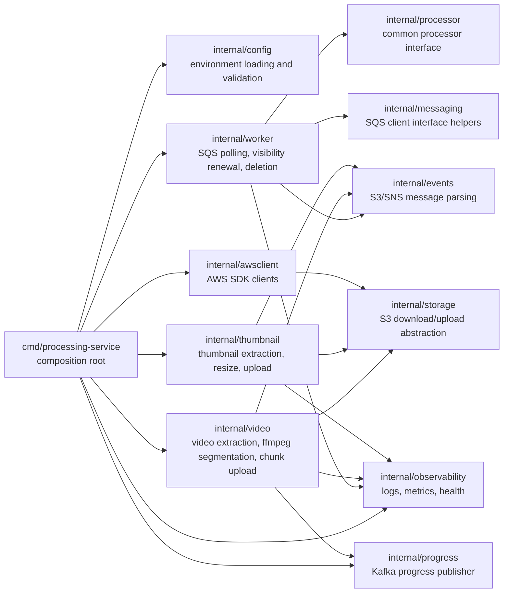
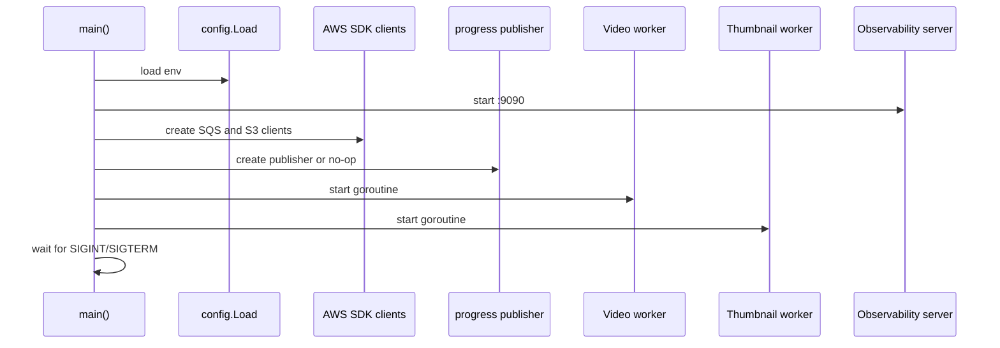

# Architecture

This document describes the architecture of the X Tube Go `processing-service` only. The service is part of X Tube and is responsible for asynchronous media processing.

## High-Level Architecture

The service starts two independent SQS workers:

- A video worker bound to `SQS_VIDEO_PROCESSING_URL`.
- A thumbnail worker bound to `SQS_THUMBNAIL_PROCESSING_URL`.

Both workers use the same S3 object store implementation.

## Internal Package Responsibilities

| Package | Responsibility |
| --- | --- |
| `cmd/processing-service` | Loads config, creates logger, AWS clients, S3 store, Kafka publisher, processors, and workers. |
| `internal/config` | Reads environment variables, applies defaults, and validates required values. |
| `internal/awsclient` | Builds AWS SDK S3 and SQS clients, including optional custom endpoint overrides. |
| `internal/events` | Parses S3 event messages, SNS-wrapped S3 messages, and ignores S3 test events. |
| `internal/messaging` | Defines the SQS client interface and masks receipt handles for logs. |
| `internal/worker` | Polls SQS, renews message visibility, invokes processors, records metrics, and deletes messages after success. |
| `internal/processor` | Defines the common `Name` and `Process` interface used by workers. |
| `internal/storage` | Downloads S3 objects to files and uploads files to S3 with inferred content type. |
| `internal/video` | Validates video events, derives `video_id`, runs ffmpeg, uploads chunks, and publishes Kafka progress. |
| `internal/thumbnail` | Validates thumbnail events, resizes images, uploads original and resized thumbnails. |
| `internal/progress` | Defines the video progress event contract and Kafka writer implementation. |
| `internal/observability` | Provides JSON logger setup, Prometheus metrics, `/health`, and `/metrics`. |

## Runtime Model

## AWS SDK Integration

The service uses AWS SDK for Go v2.

- `AWS_ENDPOINT_URL` is optional. When set, both S3 and SQS use the custom endpoint.
- S3 uses path-style addressing when `AWS_ENDPOINT_URL` is set.
- Credentials are loaded by the AWS SDK default chain.
- The service expects the configured S3 buckets and SQS queues to exist. Provisioning those resources is outside this service documentation.

## Kafka Integration

Kafka progress publishing is implemented in `internal/progress`.

- The default topic is `xtube.video.progress`.
- `KAFKA_BROKERS` accepts comma-separated brokers.
- `KAFKA_ENABLED=false` replaces Kafka with a no-op publisher.
- If Kafka is enabled and a progress event cannot be published, video processing fails and the SQS message is not deleted.
- The service expects the configured topic to exist. Kafka provisioning is outside this service documentation.

## Observability

The service starts an HTTP server on `:9090` with:

| Endpoint | Behavior |
| --- | --- |
| `/health` | Returns `200 OK` and body `ok`. |
| `/metrics` | Prometheus metrics via `promhttp.Handler`. |

Metrics currently cover SQS processing:

| Metric | Labels |
| --- | --- |
| `sqs_messages_received_total` | `queue` |
| `sqs_messages_processed_total` | `queue`, `status` |
| `sqs_messages_deleted_total` | `queue` |
| `sqs_processing_duration_seconds` | `queue` |

## Explicit Non-Responsibilities

This repository does not implement:

- Upload API.
- Playback API.
- Authentication or authorization.
- Catalog or recommendation logic.
- Frontend behavior.
- Any HTTP API beyond health and metrics.
