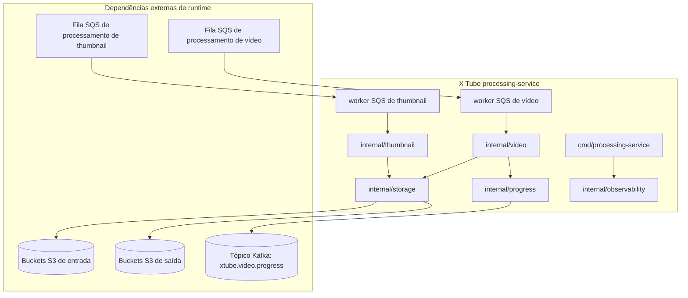
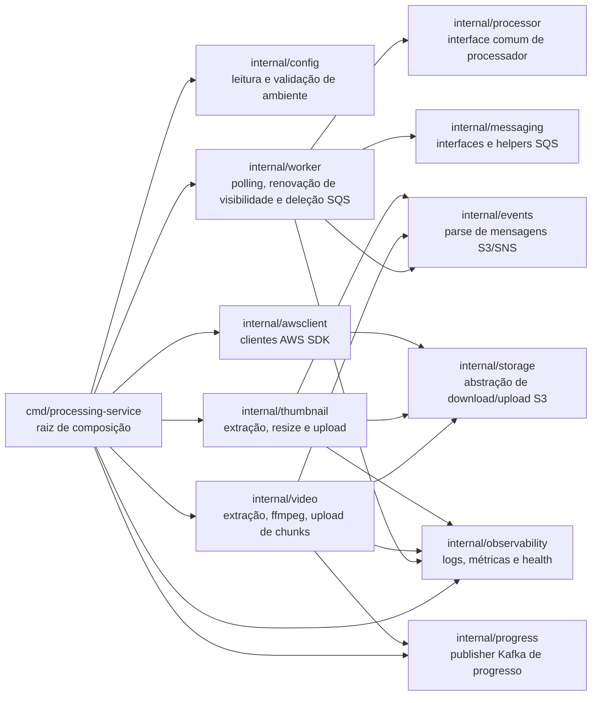
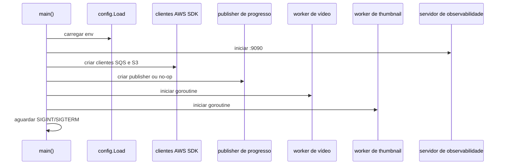

# Arquitetura

Este documento descreve apenas a arquitetura do `processing-service` Go do X Tube. O serviço faz parte do X Tube e é responsável pelo processamento assíncrono de mídia.

## Arquitetura De Alto Nível

O serviço inicia dois workers SQS independentes:

- Um worker de vídeo ligado a `SQS_VIDEO_PROCESSING_URL`.
- Um worker de thumbnail ligado a `SQS_THUMBNAIL_PROCESSING_URL`.

Ambos usam a mesma implementação de object store S3.

## Responsabilidades Dos Pacotes Internos

| Pacote | Responsabilidade |
| --- | --- |
| `cmd/processing-service` | Carrega configuração, cria logger, clientes AWS, store S3, publisher Kafka, processadores e workers. |
| `internal/config` | Lê variáveis de ambiente, aplica defaults e valida valores obrigatórios. |
| `internal/awsclient` | Cria clientes S3 e SQS do AWS SDK, incluindo endpoint customizado opcional. |
| `internal/events` | Faz parse de eventos S3, mensagens S3 encapsuladas em SNS e ignora eventos de teste do S3. |
| `internal/messaging` | Define a interface SQS e mascara receipt handles em logs. |
| `internal/worker` | Faz polling SQS, renova visibilidade, chama processadores, registra métricas e deleta mensagens após sucesso. |
| `internal/processor` | Define a interface comum `Name` e `Process` usada pelos workers. |
| `internal/storage` | Baixa objetos S3 para arquivos e faz upload de arquivos com content type inferido. |
| `internal/video` | Valida eventos de vídeo, deriva `video_id`, executa ffmpeg, faz upload de chunks e publica progresso Kafka. |
| `internal/thumbnail` | Valida eventos de thumbnail, redimensiona imagens e envia original e versão reduzida. |
| `internal/progress` | Define o contrato do evento de progresso e a implementação Kafka. |
| `internal/observability` | Fornece logger JSON, métricas Prometheus, `/health` e `/metrics`. |

## Modelo De Runtime

## Integração Com AWS SDK

O serviço usa AWS SDK for Go v2.

- `AWS_ENDPOINT_URL` é opcional. Quando definido, S3 e SQS usam o endpoint customizado.
- S3 usa path-style quando `AWS_ENDPOINT_URL` está definido.
- Credenciais são carregadas pela cadeia padrão do AWS SDK.
- O serviço espera que os buckets S3 e filas SQS configurados já existam. Provisionar esses recursos está fora do escopo desta documentação.

## Integração Kafka

A publicação de progresso Kafka está implementada em `internal/progress`.

- O tópico padrão é `xtube.video.progress`.
- `KAFKA_BROKERS` aceita brokers separados por vírgula.
- `KAFKA_ENABLED=false` substitui Kafka por um publisher no-op.
- Se Kafka estiver habilitado e um evento de progresso não puder ser publicado, o processamento de vídeo falha e a mensagem SQS não é deletada.
- O serviço espera que o tópico configurado já exista. Provisionar Kafka está fora do escopo desta documentação.

## Observabilidade

O serviço inicia um servidor HTTP em `:9090` com:

| Endpoint | Comportamento |
| --- | --- |
| `/health` | Retorna `200 OK` e corpo `ok`. |
| `/metrics` | Métricas Prometheus via `promhttp.Handler`. |

As métricas atuais cobrem processamento SQS:

| Métrica | Labels |
| --- | --- |
| `sqs_messages_received_total` | `queue` |
| `sqs_messages_processed_total` | `queue`, `status` |
| `sqs_messages_deleted_total` | `queue` |
| `sqs_processing_duration_seconds` | `queue` |

## Não Responsabilidades

Este repositório não implementa:

- API de upload.
- API de playback.
- Autenticação ou autorização.
- Catálogo ou recomendação.
- Frontend.
- Qualquer API HTTP além de health e métricas.
