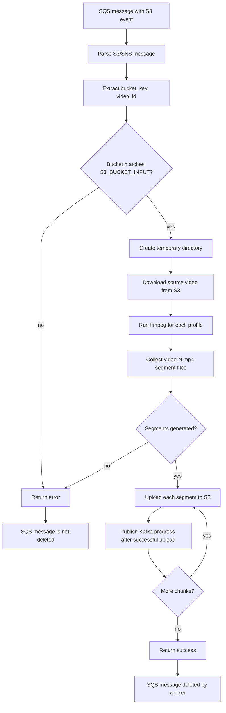
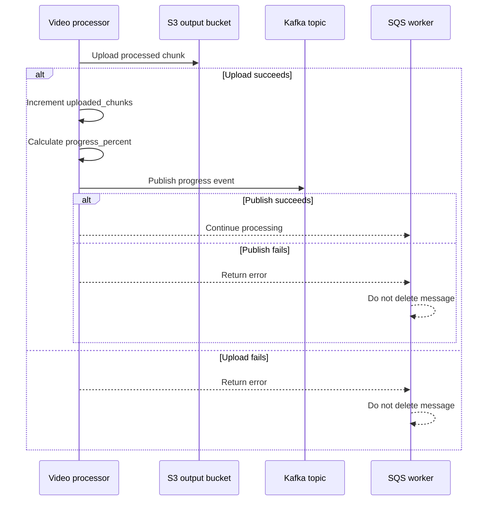
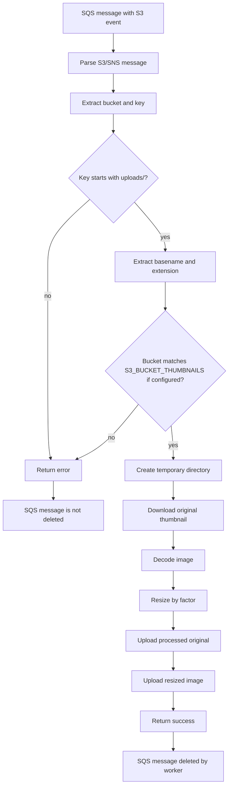
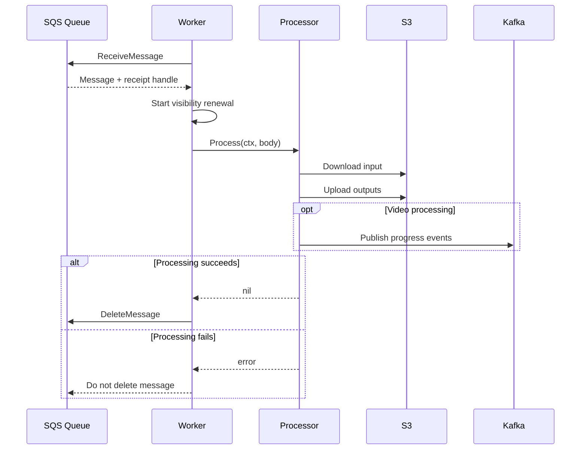
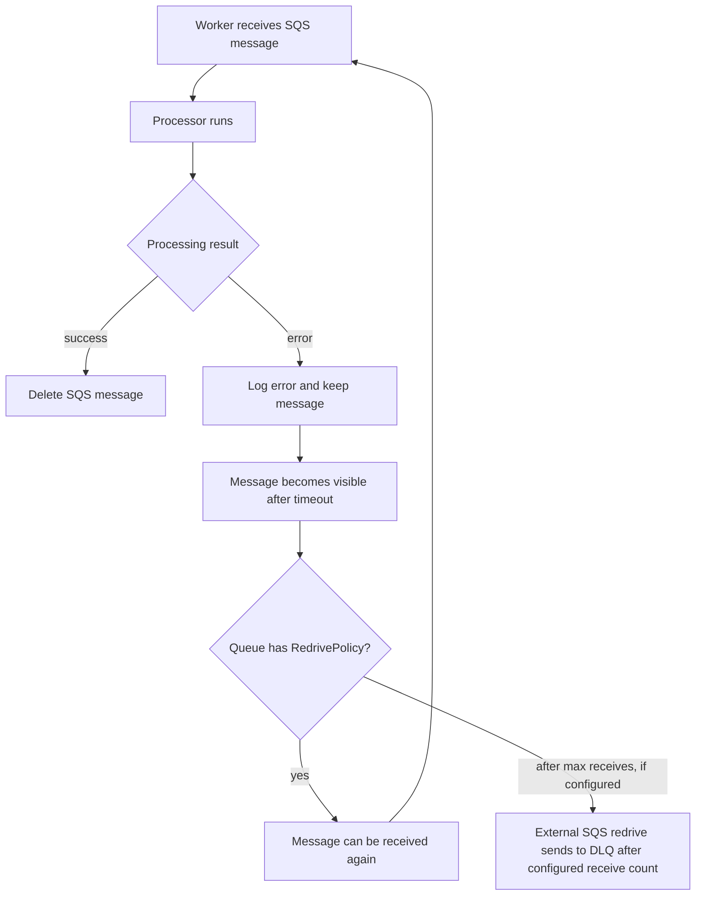

# Processing Flows

This document describes the actual media processing flows implemented by the X Tube Go `processing-service`.

## Video Processing Flow



### Input Expectations

The video processor accepts S3 events from `S3_BUCKET_INPUT`.

Example input key:

```text
uploads/music.mp4
uploads/video-123/original.mp4
```

### Video ID Derivation

The current implementation derives `video_id` as follows:

| Key shape                        | Derived `video_id` |
| -------------------------------- | ------------------ |
| `uploads/video-123/original.mp4` | `video-123`        |
| `uploads/music.mp4`              | `music`            |
| `nested/plain-video.mov`         | `plain-video`      |

If the key has at least three path parts and begins with `uploads/`, the second part is used. Otherwise, the file basename without extension is used.

### Temporary Files

The processor creates a temporary directory with prefix `xtube-video-*`.

Inside it:

```text
input{original_extension}
segments/{profile}/video-{n}.mp4
```

The directory is removed when processing finishes or fails.

### ffmpeg Behavior

The `FFmpegTranscoder` runs `ffmpeg` once per profile. Default profiles are fixed in code:

| Profile | Height |
| ------- | ------ |
| `360p`  | `360`  |
| `480p`  | `480`  |
| `720p`  | `720`  |

The segment duration defaults to `10` seconds and is controlled by `VIDEO_SEGMENT_SECONDS`.

Generated segment files are named:

```text
video-1.mp4
video-2.mp4
video-3.mp4
```

### Output S3 Layout

Processed video chunks are uploaded to `S3_BUCKET_OUTPUT`:

```text
{video_id}/{resolution}/{file_name}
```

Example:

```text
music/360p/video-1.mp4
music/360p/video-2.mp4
music/480p/video-1.mp4
music/720p/video-1.mp4
```

### Progress Calculation

After ffmpeg finishes all configured profiles, the service knows the total number of chunks.

```text
progress_percent = uploaded_chunks * 100 / total_chunks
```

The calculation uses integer division, clamps at `100`, and forces the last chunk to `100`.

## Kafka Progress Event Flow



The event is intentionally small:

```json
{
  "video_id": "video-id",
  "progress_percent": 37
}
```

No bucket, key, resolution, chunk name, or metadata is included.

### Kafka Failure Behavior

| Condition                          | Behavior                                                          |
| ---------------------------------- | ----------------------------------------------------------------- |
| `KAFKA_ENABLED=false`              | A no-op publisher is used and processing continues without Kafka. |
| Kafka enabled and publish succeeds | Processing continues.                                             |
| Kafka enabled and publish fails    | Video processing returns an error; SQS message is not deleted.    |

## Thumbnail Processing Flow



### Thumbnail Input Expectations

Thumbnail keys must be under:

```text
uploads/
```

Example:

```text
uploads/maxresdefault.jpg
```

Keys under `processed/` are rejected by the processor. This avoids processing output objects again if S3 emits events for processed thumbnails.

### Thumbnail Output Layout

The processor writes both the original and resized thumbnail back to the same thumbnail bucket:

```text
xtube-thumbnails/
├── uploads/
│   └── maxresdefault.jpg
└── processed/
    └── maxresdefault/
        ├── original.jpg
        └── 3x.jpg
```

Output key rules:

```text
processed/{basename}/original{extension}
processed/{basename}/{resizeFactor}x{extension}
```

The default resize factor is `3`, controlled by `THUMBNAIL_RESIZE_FACTOR`.

Supported output formats:

- `.jpg`
- `.jpeg`
- `.png`
- `.gif`

## SQS Message Lifecycle



Worker polling behavior:

| Setting                      | Environment variable                       | Default |
| ---------------------------- | ------------------------------------------ | ------- |
| Max messages per poll        | `SQS_MAX_MESSAGES`                         | `10`    |
| Long poll wait time          | `SQS_WAIT_TIME_SECONDS`                    | `20`    |
| Video visibility timeout     | `SQS_VIDEO_VISIBILITY_TIMEOUT_SECONDS`     | `3600`  |
| Thumbnail visibility timeout | `SQS_THUMBNAIL_VISIBILITY_TIMEOUT_SECONDS` | `600`   |
| Polling error delay          | `SQS_ERROR_DELAY_SECONDS`                  | `2`     |

The worker renews visibility at half the visibility timeout when no explicit renewal interval is configured in code.

## Failure And Retry Flow



The application does not implement a custom retry loop. Retries happen through SQS visibility timeout and the queue's redrive policy. The worker detects whether a redrive policy exists and logs `dlq_handled_by_redrive_policy`.
