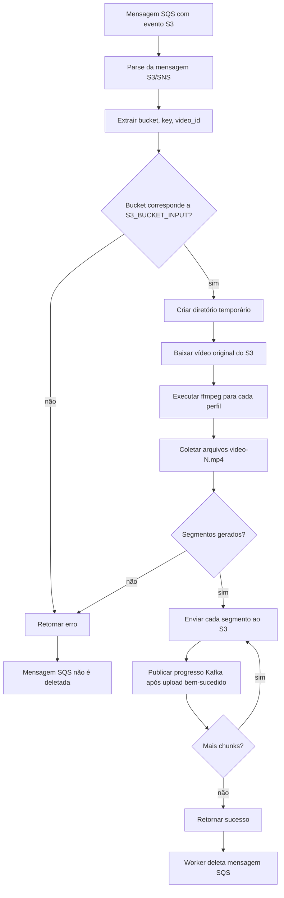
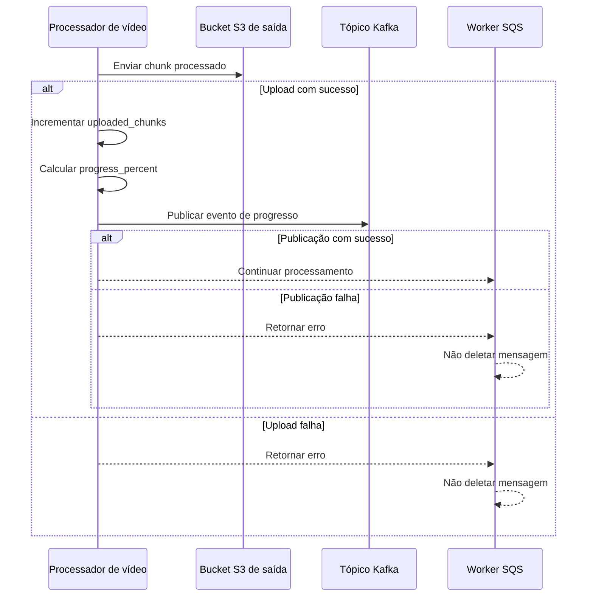
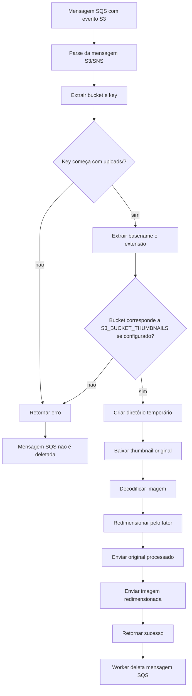
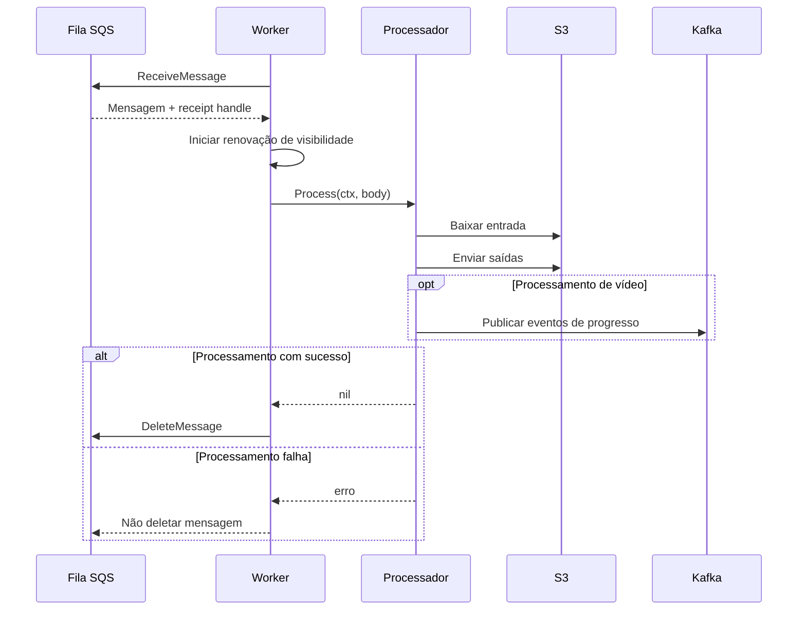
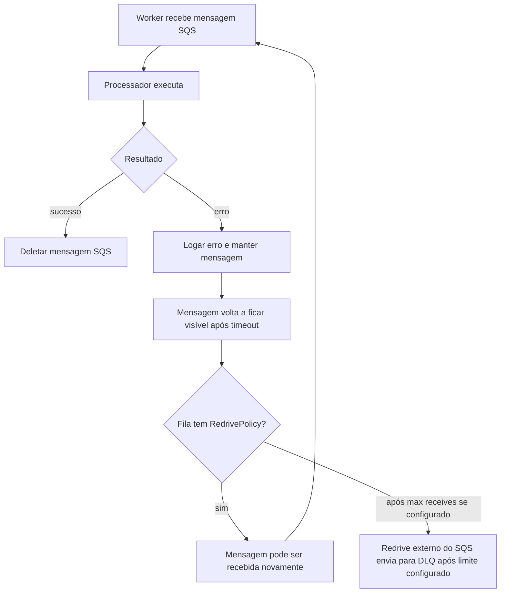

# Fluxos De Processamento

Este documento descreve os fluxos reais de processamento de mídia implementados pelo `processing-service` Go do X Tube.

## Fluxo De Processamento De Vídeo



### Expectativas De Entrada

O processador de vídeo aceita eventos S3 de `S3_BUCKET_INPUT`.

Exemplos de chave:

```text
uploads/music.mp4
uploads/video-123/original.mp4
```

### Derivação Do Video ID

A implementação atual deriva `video_id` assim:

| Formato da chave                 | `video_id` derivado |
| -------------------------------- | ------------------- |
| `uploads/video-123/original.mp4` | `video-123`         |
| `uploads/music.mp4`              | `music`             |
| `nested/plain-video.mov`         | `plain-video`       |

Se a chave tiver pelo menos três partes e começar com `uploads/`, a segunda parte é usada. Caso contrário, o basename do arquivo sem extensão é usado.

### Arquivos Temporários

O processador cria um diretório temporário com prefixo `xtube-video-*`.

Dentro dele:

```text
input{extensão_original}
segments/{perfil}/video-{n}.mp4
```

O diretório é removido quando o processamento termina ou falha.

### Comportamento Do ffmpeg

O `FFmpegTranscoder` executa `ffmpeg` uma vez por perfil. Os perfis padrão são fixos no código:

| Perfil | Altura |
| ------ | ------ |
| `360p` | `360`  |
| `480p` | `480`  |
| `720p` | `720`  |

A duração padrão dos segmentos é `10` segundos e é controlada por `VIDEO_SEGMENT_SECONDS`.

Os arquivos gerados são nomeados:

```text
video-1.mp4
video-2.mp4
video-3.mp4
```

### Layout De Saída No S3

Chunks de vídeo processado são enviados para `S3_BUCKET_OUTPUT`:

```text
{video_id}/{resolution}/{file_name}
```

Exemplo:

```text
music/360p/video-1.mp4
music/360p/video-2.mp4
music/480p/video-1.mp4
music/720p/video-1.mp4
```

### Cálculo De Progresso

Depois que o ffmpeg termina todos os perfis configurados, o serviço conhece o total de chunks.

```text
progress_percent = uploaded_chunks * 100 / total_chunks
```

O cálculo usa divisão inteira, limita em `100` e força o último chunk a publicar `100`.

## Fluxo Do Evento Kafka De Progresso



O evento é intencionalmente pequeno:

```json
{
  "video_id": "video-id",
  "progress_percent": 37
}
```

Nenhum bucket, key, resolução, nome de chunk ou metadado é incluído.

### Comportamento Em Falha Kafka

| Condição                                  | Comportamento                                                         |
| ----------------------------------------- | --------------------------------------------------------------------- |
| `KAFKA_ENABLED=false`                     | Um publisher no-op é usado e o processamento continua sem Kafka.      |
| Kafka habilitado e publicação com sucesso | O processamento continua.                                             |
| Kafka habilitado e publicação falha       | O processamento de vídeo retorna erro; a mensagem SQS não é deletada. |

## Fluxo De Processamento De Thumbnail



### Expectativas De Entrada De Thumbnail

Chaves de thumbnail devem estar em:

```text
uploads/
```

Exemplo:

```text
uploads/maxresdefault.jpg
```

Chaves em `processed/` são rejeitadas pelo processador. Isso evita processar novamente objetos de saída caso o S3 emita eventos para thumbnails processadas.

### Layout De Saída De Thumbnail

O processador grava o original e a versão redimensionada no mesmo bucket de thumbnails:

```text
xtube-thumbnails/
├── uploads/
│   └── maxresdefault.jpg
└── processed/
    └── maxresdefault/
        ├── original.jpg
        └── 3x.jpg
```

Regras de chave:

```text
processed/{basename}/original{extension}
processed/{basename}/{resizeFactor}x{extension}
```

O fator padrão é `3`, controlado por `THUMBNAIL_RESIZE_FACTOR`.

Formatos de saída suportados:

- `.jpg`
- `.jpeg`
- `.png`
- `.gif`

## Ciclo De Vida Da Mensagem SQS



Comportamento de polling:

| Configuração                         | Variável de ambiente                       | Default |
| ------------------------------------ | ------------------------------------------ | ------- |
| Máximo de mensagens por poll         | `SQS_MAX_MESSAGES`                         | `10`    |
| Tempo de long polling                | `SQS_WAIT_TIME_SECONDS`                    | `20`    |
| Timeout de visibilidade de vídeo     | `SQS_VIDEO_VISIBILITY_TIMEOUT_SECONDS`     | `3600`  |
| Timeout de visibilidade de thumbnail | `SQS_THUMBNAIL_VISIBILITY_TIMEOUT_SECONDS` | `600`   |
| Delay após erro de polling           | `SQS_ERROR_DELAY_SECONDS`                  | `2`     |

O worker renova a visibilidade na metade do timeout quando nenhum intervalo explícito é configurado no código.

## Fluxo De Falha E Retry



A aplicação não implementa retry manual. Retries acontecem pelo timeout de visibilidade do SQS e pela política de redrive da fila. O worker detecta se existe redrive policy e registra `dlq_handled_by_redrive_policy`.
